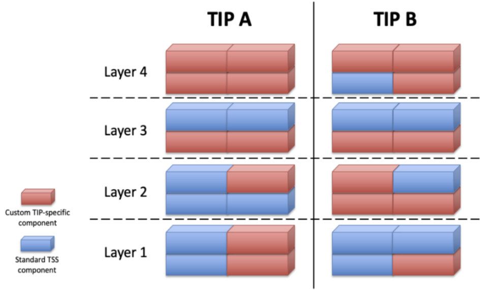

# TIP Lifecycle Management

## Concept

### What is a TIP?
As we seek solutions for an interoperable digital trust marketplace, we must recognize that market dynamics will often drive solution incubation and adoption. In the context of a ToIP, *Market Dynamics* are the market forces that impact the validation and adoption behaviors of producers and consumers of a specific solution architectures.

A **ToIP Interoperability Profile (TIP)** is a specific type of specification produced by members of the Technical Stack WG ("TSWG"). Analogous to how cooking recipes are composed of specific ingredients, a TIP describes a target solution architecture that is based on a specific set of standards, protocols and technologies.

A TIP represents a solution architecture that once matured can be the basis for a market proven solution specification. TIPs can be designed, refined and supported by interoperable vendors.

A TIP definition will:

* articulate the motivating design principles behind the solution profile
* clearly position standards, protocols and software components (collectively, "technologies") against each layer of the [ToIP Technical Stack]().  
* demonstrate incubation activity towards the market adoption of the architecture using a set of *key adoption indicators (KAI)*.

As a TIP is incubated in the marketplace, several work-products will provide evidence of its maturation. TIPs can be designed, refined and supported by multiple vendors and customers wishing to collaborate on interoperability. A TIP typically includes the following elements critical to industry success:

* **Use cases**: Descriptive application scenarios capturing the specific requirements of customers in one or more digital trust ecosystems.
* **Design Principles**: Market requirements are necessary when combining technology to formulate a solution architecture. Yet technology alone does not make a solution. Design Principles help to clearly define how the combination of technology and business policies formulate a solution architecture.
* **White-paper**: Documentation that clearly communicates the design, architecture, features, and benefits of a TIP to a digital trust ecosystems targeted for adoption.
* **Market Dynamics**:

    * **Adoption Metrics**: Case study references that provide quantifiable evidence of the real market impact.
    * **Interoperability Testing**: Community driven certification of test cases and results.    
    * **Vendor Support**: Vertical integration of the technical stack must be supported by vendors that can demonstrate the interoperability between multiple vendor solutions that support the TIP.

* **Best Practices**: Implementation guidance for adoption of a TIP, including how to incorporate policies from the ToIP governance stack.

TIPs harness market forces to drive convergence on interoperability

As technology evolves, TIPs will also evolve. This implies that during the lifecycle of a TIP, the various underlying components required to enable a solution will be comprised of an array of standardized and customized components. As depicted by the conceptual “lego block” picture below of a complete four-layer TIP—showing how it is constructed from a combination of of ToIP Deliverables (including ToIP Standard Specifications (TSS)) and custom TIP-specific components.

* Fully-standardized components of the ToIP stack. These components are ToIP deliverables that have already gained Foundation-wide approval.
* Custom components that are specific to a TIP. Some places in the ToIP stack do not yet have agreed-upon specifications. For these gaps, a TIP must specify how it fills the gap via an open community specification that can be implemented by any vendor or open source project.

### Why do we need TIPs?
Ultimately, entities (business, governments, organizations) that seek to participate in an interoperable digital trust marketplace will need to assess (compare) solution architectures. Analogous to a Request for Proposal (RFP) process, entities should be able to align their requirements with the principles and expectations described by a TIP and use such a comparison exercise to make educated decisions. Allow when to compare apples-to-apples and when necessary enable clear articulation of apples-to-oranges activities.

### Who would use a TIP?
As Ecosystem Projects (See Ecosystem Foundry WG) evolve they will need to define governance frameworks and select a TIP.

### What is the scope of interoperability for a TIP?
In a utopian world solution architectures would be interoperable both vertically and horizontally across the Technology Stack. But this is not the goal of ToIP and in fact at some layers of the technology Stack, horizontal interoperability is not even necessary.

For clarity, TIPs needs to first focus on vertical interoperability where the connecting of the technology components at each layer is seamless and well understood. Horizontal interoperability across TIPs is not important until we have 2 or more TIPs with enough market adoption to necessitate community energy.  

While horizontal interoperability at layer 3 (a wallet affiliated with TIP-A can exchange data with a wallet that supports TIP-B and both TIPs use different Layer 3 tech) would be important, the ability of a Layer 1 Utility based of on technology-A needing to exchange data with a Utility based on technology-B is less important.

## TSWG Responsibilities
The Technical Stack WG is responsible for the processes and procedures of the WG as well as the lifecycle of TIP incubation.

* **Stack Attributes**: One of the deliverables of the Tech Stack WG (TSWG) is to provide guidance on the type of technology that can (could) be considered applicable at each layer of the Technology Stack. Additionally, what the architectural requirements are for vertical interoperability between the layers. This work effort MUST be technology neutral.
* **TIP Criteria**: What are the requirements for proposing a TIP to the WG?
* **TIP Incubation**: Establishment and Management of the TIP Lifecycle Process
* **TIP Graduation**: Review and approval process for the formalization of a TIP into a recommendation (TSS?)

## Lifecycle Management Process
The ToIP Foundation, which is technology agnostic, represents a collaborative forum where solution “recipes” can be matured and vetted in the market.

* **Proposed**: Using a predefined template, propose a TIP to the TSWG to get the approval to establish a ToIP TIP repo.
* **Demonstrated**: incubate the TIP within the community to address the maturation criteria outlined by the TSWG.
* **Accepted**: The TSWG believes a TIP is worthy of a recommendation as a specification and the community has decided to formalize it as a recommendation.
* **Adopted**: The TIP has graduated to a formal recommendation.
* **Retired**: The proposers of the TIP have determined that the maturation process has failed or permanently stalled.

## Getting Started
[Discover exiting TIPs or learn how to create your own](./TIP_GETTING_STARTED.md).
